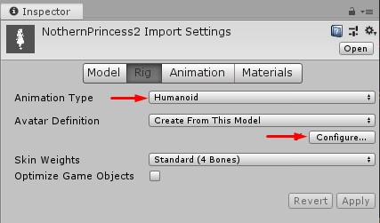
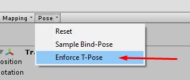

# Tivoli Avatar Exporter for Unity

<iframe width="560" height="315" src="https://www.youtube.com/embed/ywNXxd35Lzg" frameborder="0" allow="accelerometer; autoplay; encrypted-media; gyroscope; picture-in-picture" allowfullscreen></iframe>

These instructions explain how to prepare an avatar in Unity, upload it to Tivoli Cloud VR's file hosting service, and use it in Tivoli Cloud VR. This document assumes you already have an avatar model imported into Unity. If you don't know how to import a model into Unity, [check Unity's documentation](https://docs.unity3d.com/Manual/HOWTO-importObject.html).

## Get & Install the Avatar Exporter in Unity

1. [Download the Tivoli Avatar Exporter](https://git.tivolicloud.com/tivolicloud/unity-avatar-exporter/-/releases) .unitypackage file from the Tivoli Cloud VR gitlab server.

2. Launch (or install) the current LTS version of [Unity](https://unity3d.com/get-unity/download) and create or open a project with your avatar inside.

3. Import the .unitypackage with _Edit > Import Package_. Once installed, you'll see a menu item called _Tivoli Cloud VR_ on your menu bar.

    

---

## Prepare and configure your avatar

1.  Make sure the materials' shaders are set to either _unlit_ or _standard_. The _unlit_ shader is better for flat, cartoon style artwork, and _standard_ for realistic PBR rendering.

    

2.  Select the avatar's model in the project panel. In the Inspector window, animation properties will appear. Press the _Rig_ tab, then set _Animation Type_ to _Humanoid_, and press _Configure_.

    

3.  The _Avatar Mapping_ panel will appear. Click the _Pose_ dropdown and choose _Enforce T-Pose_. Press _Apply_ and _Done_.

    

    !!! warning

        If any of the bone slots in the _Avatar Mapping_ panel are red, you'll need to configure your model by dragging the correct bones to the corresponding slot. See [Unity's documentation on this](https://docs.unity3d.com/Manual/class-Avatar.html).

4.  Select your avatar model in the project panel, then select _Tivoli Cloud VR_ > _Export Avatar_ from the menu bar. Give your avatar project a name in the _Export project name_ and choose a good default scale for your avatar using the _Scale_ slider. This is the size your avatar will appear when you load into a new world.

    

---

!!! tip

    Your Tivoli Cloud VR account includes free file hosting, which you can access from _Apps>My Files_. You can host your avatar or other assets for use in your virtual world.

## Upload your avatar to Tivoli Cloud VR files & wear it

1. Log in to your Tivoli Cloud VR account in your web browser at tivolicloud.com.

2. Click _Apps_ and select _My Files_.

    

3. Press the _Create Folder_ button, click _Upload_ and drag in the files created by the exporter.

    

4. Right click the _avatar.fst_ file and choose _Copy URL to clipboard_.

    

5. Launch Tivoli Cloud VR and click the _Avatar_ button on your tablet or toolbar. Press the _Update Avatar URL_ button, paste the URL, and press Update to wear it.

    

!!! tip

    Press _Add to Favorites_ if you'd like to bookmark your avatar.
