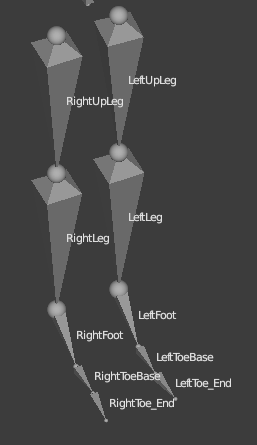
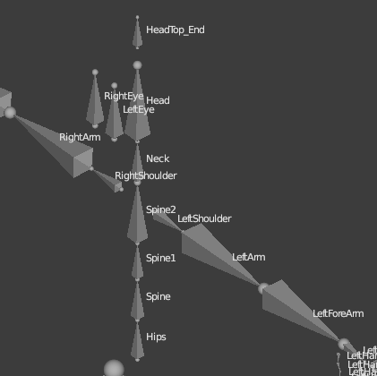
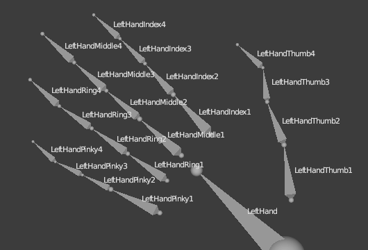

# Avatar standards

## Skeleton





```
Hips
|―― LeftUpLeg
|   `―― LeftLeg
|       `―― LeftFoot
|           `―― LeftToeBase
|―― RightUpLeg
|   `―― RightLeg
|       `―― RightFoot
|           `―― RightToeBase
`―― Spine
    `―― Spine1
        `―― Spine2
            |―― Neck
            |   `―― Head
            |       |―― HeadTop_End
            |       |―― LeftEye
            |       `―― RightEye
            |―― LeftShoulder
            |   `―― LeftArm
            |       `―― LeftForeArm
            |           `―― LeftHand
            |               |―― LeftHandThumb1
            |               |   `―― LeftHandThumb2
            |               |       `―― LeftHandThumb3
            |               |―― LeftHandIndex1
            |               |   `―― LeftHandIndex2
            |               |       `―― LeftHandIndex3
            |               |―― LeftHandMiddle1
            |               |   `―― LeftHandMiddle2
            |               |       `―― LeftHandMiddle3
            |               |―― LeftHandRing1
            |               |   `―― LeftHandRing2
            |               |       `―― LeftHandRing3
            |               `―― LeftHandPinky1
            |                   `―― LeftHandPinky2
            |                       `―― LeftHandPinky3
            `―― RightShoulder
                `―― RightArm
                    `―― RightForeArm
                        `―― RightHand
                            |―― RightHandThumb1
                            |   `―― RightHandThumb2
                            |       `―― RightHandThumb3
                            |―― RightHandIndex1
                            |   `―― RightHandIndex2
                            |       `―― RightHandIndex3
                            |―― RightHandMiddle1
                            |   `―― RightHandMiddle2
                            |       `―― RightHandMiddle3
                            |―― RightHandRing1
                            |   `―― RightHandRing2
                            |       `―― RightHandRing3
                            `―― RightHandPinky1
                                `―― RightHandPinky2
                                    `―― RightHandPinky3
```

## Blendshapes

You don't have to add every blendshape, just the ones you want to use.

### Basic blendshapes

These blendshapes are the most used.

-   **`EyeBlink_L`** Blinking action for the left eye
-   **`EyeBlink_R`** Blinking action for the right eye
-   **`JawOpen`** Opening of the jaw

### Audio blendshapes

These blendshapes are used when you speak.

Your eyebrows are blendshapes that react to a change in volume. They will move upwards when your voice gets louder. These include:

-   **`BrowsU_C`** Center of the brow going up
-   **`BrowsU_L`** Outside corner of the left brow going up
-   **`BrowsU_L`** Outside corner of the right brow going up

Other audio blendshapes are randomly mixed when you speak. These include:

-   **`MouthSmile_L`** Left side of the mouth lifting up to a smile
-   **`MouthSmile_R`** Right side of the mouth lifting up to a smile
-   **`LipsFunnel`** Funneling of the lips, as when you say “Oh!”
-   **`LipsUpperClose`** Upper lips rolled inwards

### Eyelid offset

To ensure that the top of the eyelid rests on the iris, blendshapes are used to track the current position of the eye along with your head orientation.

-   **`EyeBlink_L`** Blinking action for the left eye
-   **`EyeBlink_R`** Blinking action for the right eye
-   **`EyeOpen_L`** Opening of left eye
-   **`EyeOpen_R`** Opening of right eye
-   **`BrowsD_L`** Outside corner of the left brow moving down
-   **`BrowsD_R`** Outside corner of the right brow moving down

We apply a small procedural offset to the blendshape coefficients to prevent sleepy or crazy eye lids:

-   If you are looking straight ahead: The **`EyeBlink`** and **`EyeOpen`** coefficients will be **`0`**.
    <br><br>
-   If your eyes begin to look upward: **`EyeBlink`**, **`EyeOpen`**, and **`BrowsU`** start changing in value, reaching the values of **`-1`**, **`1`**, and **`0.5`** respectively at **`16.3`** degrees. This will have the effect of raising your lids and brows as you look upward.
    <br><br>
-   If your eyes begin to look downward: **`EyeBlink`** and **`EyeOpen`** start changing in value. **`EyeBlink`** reaches a value of **`0.5`** at **`32`** degrees. **`EyeOpen`** will reach a value of **`0.5`** at **`27`** degrees. This will have the effect of lowering your lids as you look downward.

Tweaks to your blendshapes can be made with a 3D modeling tool, or directly in your avatar’s FST file. In the FST file, blendshapes are defined with the syntax:

```ini
bs = [blendshape constant] = [your blendshape name] = [value between 0 and 1]
```

Here is an example of modifying your blendshapes in your FST file:

```ini
bs = BrowsU_L = head_BS_brow_up = 0.3
bs = BrowsU_C = head_BS_brow_up = 0.3
bs = BrowsU_R = head_BS_brow_up = 0.3
bs = BrowsD_R = head_BS_brow_down = 0.5
bs = BrowsD_L = head_BS_brow_down = 0.5
bs = EyeBlink_L = head_BS_L_eye_close = 1
bs = EyeBlink_R = head_BS_R_eye_close = 1
bs = EyeOpen_L = head_BS_L_eye_open = 1
bs = EyeOpen_R = head_BS_R_eye_open = 1
bs = JawOpen = JawOpen = 1
bs = MouthSmile_R = head_BS_L_smile = 0.6
bs = MouthSmile_L = head_BS_R_smile = 0.6
bs = LipsFunnel = head_BS_oo = 0.5
bs = LipsUpperClose = head_BS_mouth_down = 0.1
```
