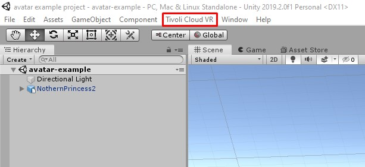
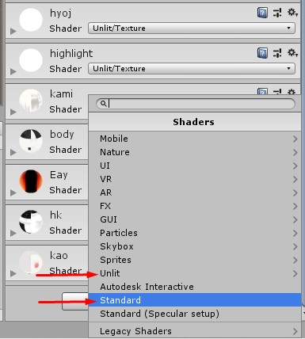
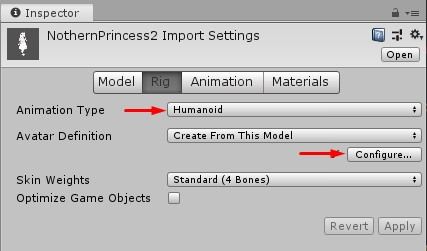
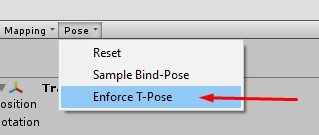
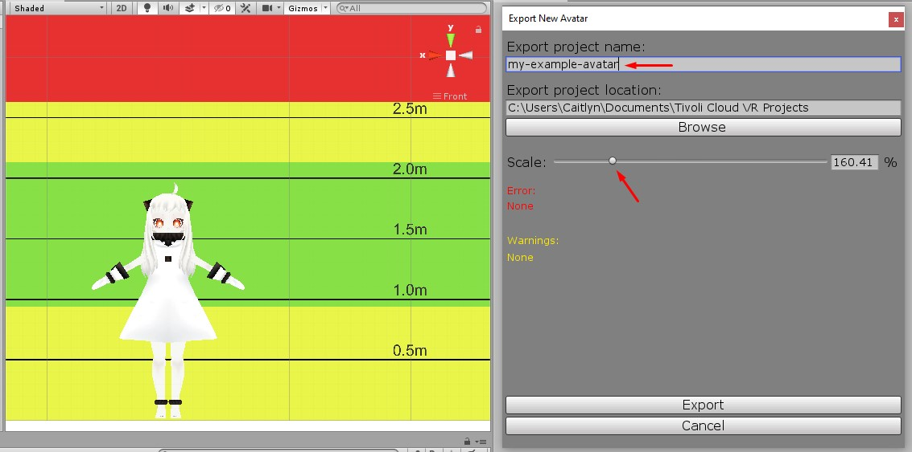
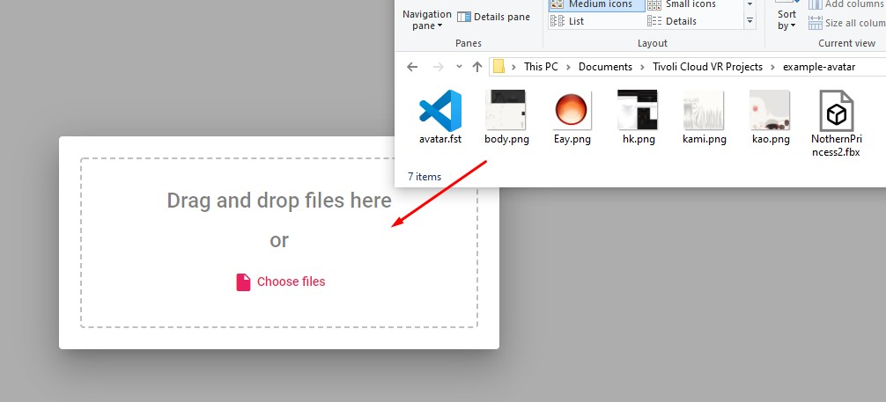
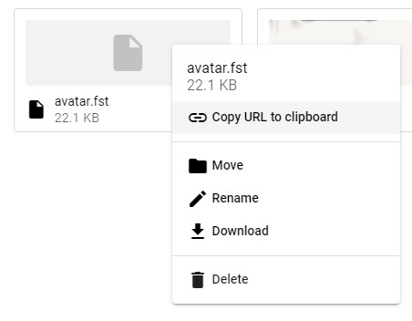
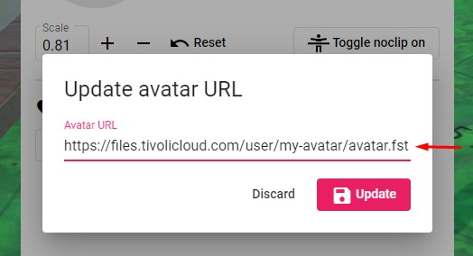

# Tivoli's Unity avatar exporter

<iframe width="560" height="315" src="https://www.youtube.com/embed/ywNXxd35Lzg" frameborder="0" allow="accelerometer; autoplay; encrypted-media; gyroscope; picture-in-picture" allowfullscreen></iframe>

These instructions explain how to prepare an avatar in Unity, upload it to Tivoli's file hosting service, and use it in-world. This document assumes you already have an avatar model imported into Unity. If you don't know how to import a model into Unity, [check Unity's documentation](https://docs.unity3d.com/Manual/HOWTO-importObject.html).

## Download and install the avatar exporter in Unity

1. [Download the Tivoli Avatar Exporter](https://git.tivolicloud.com/tivolicloud/unity-avatar-exporter/-/releases) .unitypackage from our GitLab.

2. Launch (or install) the current LTS version of [Unity](https://unity3d.com/get-unity/download) and create or open a project with your avatar inside.

3. Import the **.unitypackage** by drag and dropping into assets or with **Assets > Import Package > Custom Package**. Once installed, you'll see a menu item called **Tivoli Cloud VR** on your menu bar.

    

## Prepare and configure your avatar

1.  Make sure the materials' shaders are set to either **unlit** or **standard**. The **unlit** shader is better for flat, cartoon style artwork, and **standard** for realistic PBR rendering.

    

2.  Select the avatar's model in the project panel. In the Inspector window, animation properties will appear. Press the **Rig** tab, then set **Animation Type** to **Humanoid**, and press **Configure**.

    

3.  The **Avatar Mapping** panel will appear. Click the **Pose** dropdown and choose **Enforce T-Pose**. Press **Apply** and **Done**.

    

    !!! warning

        If any of the bone slots in the **Avatar Mapping** panel are red, you'll need to configure your model by dragging the correct bones to the corresponding slot. See [Unity's documentation on this](https://docs.unity3d.com/Manual/class-Avatar.html).

4.  Select your avatar model in the project panel, then select **Tivoli Cloud VR > Export Avatar** from the menu bar. Give your avatar project a name in the **Export project name** and choose a good default scale for your avatar using the **Scale** slider. This is the size your avatar will appear when you load into a new world.

    

## Upload your avatar to Tivoli files and wear it

!!! info

    Your Tivoli account includes free file hosting, which you can access from **Apps > My Files**. You can host your avatar or other assets for use in your virtual world.

1. Log in to your Tivoli Cloud VR account in your web browser at [tivolicloud.com](tivolicloud.com).

2. Click **Apps** and select **My Files**.

    

3. Press the **Create Folder** button, click **Upload** and drag in the files created by the exporter.

    

4. Right click the **avatar.fst** file and choose **Copy URL to clipboard**.

    

5. Launch Tivoli and click the **Avatar** button on your tablet or toolbar. Press the **Update Avatar URL** button, paste the URL, and press Update to wear it.

    

!!! info

    Press **Add to Favorites** if you'd like to bookmark your avatar.
