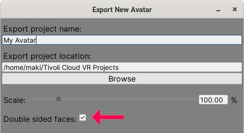

# Changelog

Download the Tivoli Unity Avatar Exporter here:
 
[https://git.tivolicloud.com/tivolicloud/unity-avatar-exporter/-/releases](https://git.tivolicloud.com/tivolicloud/unity-avatar-exporter/-/releases)

## 1.0.1 - September 6, 2020

-   **Standard** shader works now!

    When exporting with **metallic + glossiness** textures, the exporter will automatically create new textures that are compatible with Tivoli. **Standard (Specular setup)** currently doesn't work but can be fixed in the future.

-   **Autodesk interactive** shader works as well now. It was originally called **Standard (Roughness setup)** but the rename broke the exporter.

-   When exporting, the **scale slider** works now with locales that use comma as the decimal separator, for example: Germany, Belgium, etc.

-   Added **double sided faces** toggle when exporting. Unfortunately Unity doesn't let you enable it per material but it's an export option for now. It's disabled by default.

    

## 1.0.0 - June 27, 2020

Initial release!
