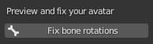
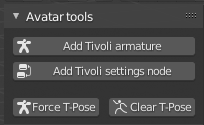
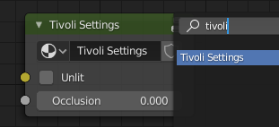
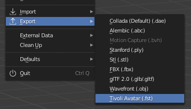

# Changelog

Download the Tivoli Blender Tool here:
 
[https://git.tivolicloud.com/tivolicloud/blender-tools/-/releases](https://git.tivolicloud.com/tivolicloud/blender-tools/-/releases)

[:material-rss: RSS feed](/blender-tools/changelog.xml)

## 1.2.1 - October 22, 2021

-   Added **as .glb** to **glTF export** for avatars

## 1.2.0 - October 8, 2021

-   Added **glTF export** when exporting as fst, which is enabled by default.

-   Added **Animation tools** panel for baking vertex animations like cloth. It's still a bit experimental.

-   WebP optimization is **disabled by default** because it's not always more efficient.

Avatar tools:

-   Added **ensure root bone** which will make sure **feet stay on the ground** in world. Yay, I hate this bug so much!
-   **Add Tivoli armature** button will automatically have a **root bone** too.

-   Added **Force T-Pose** and **Clear T-Pose** buttons back in

-   Added **Add "glTF settings" node** button

FBX Avatars:

-   Improved `materialMap` generation when exporting
-   Easily assign **unlit texture/color** with **Tivoli settings node** when exporting

## 1.1.1 - September 15, 2020

-   When exporting your avatar as **unlit**, it will now use the **emission** color or image from **Principled BSDF**

-   Added **fix bone rotations** and disabled force/clear t-pose for now as it's not necessary and broken

    

-   Fixed bug when exporting your avatar, where it should use **Principled BSDF** connected from the **Material output**

## 1.1.0 - August 4, 2020

-   When **exporting your scene to JSON, you don't need to enter your export URL** anymore. **Tivoli 0.12.0** can automatically figure out the assets next to the exported JSON.

-   Exporting light mapped scenes to JSON is more likely to work than before.

-   You can now **export avatars** through our addon!

    More features will be added soon to make this easier, such as automatically renaming bones and fixing bone rotations.

    

    -   **Add Tivoli armature** to import a reference armature

    -   **Add Tivoli settings node** to get extra settings for your materials

        When clicked, you can then add a node like this:

        

    -   **Force/Clear T-Pose** to see if the bones look correctly before exporting

    When you're happy, export your avatar through the export menu and you'll have a folder that you can upload to [Tivoli files](https://files.tivolicloud.com) or your own webserver:

    

    Find more information about our rig at the [avatar standards](../../avatars/avatar-standards) page.

## 1.0.0 - July 28, 2020

Initial release!
