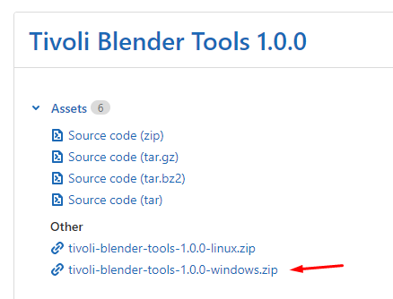
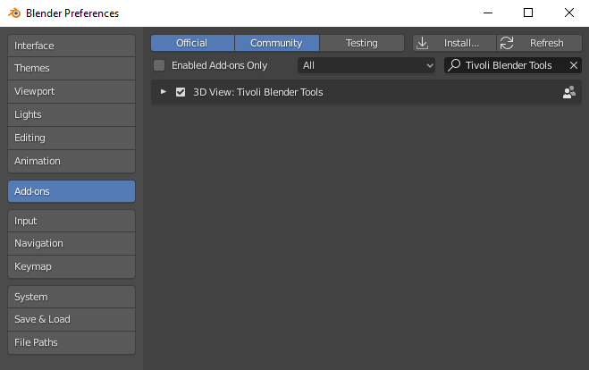
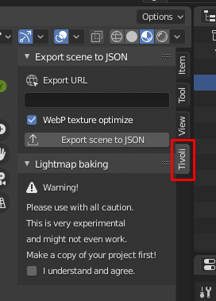

# Export a world

With Tivoli's **Blender Tools add-on**, you can build complete Tivoli worlds from inside the [Blender](<[Blender](https://www.blender.org/)>) application and export it as a scene consisting of a **JSON** file, all model entities, and optional **webp** texture conversion. There is also a (highly experimental) lightmapping system which can bake and generate lightmaps that are automatically applied to the models in your scene. The tools support Blender 2.8, and have been tested up to 2.8.3.

## Install the Tivoli Blender Tools add-on

1. [Download the Tivoli Blender Tools add-on](https://git.tivolicloud.com/tivolicloud/blender-tools/-/releases) .zip file from our GitLab. Select the relevant version depending on your operating system. You do not need to download the source files.
   
2. Launch (or install) the current LTS version of [Blender](https://blender.org/download).
3. In Blender, select **Edit > Preferences** and click the **Add-ons** tab on the left.
4. Press the **Install** button and select the add-on .zip file you downloaded in **Step 1**.
5. Check the **checkbox** next to the add-on to activate it
   

## Using the Tivoli Blender Tools add-on JSON exporter

1. In Blender, open or create a scene with multiple polygon models.
2. Press the **n** key to open Blender's sidebar panel.
3. Click the **Tivoli** tab on the sidebar panel.

    

4. Paste or type the path to the folder where the scene will be hosted. If using ** Tivoli Files**, you can create an empty folder and copy its URL.
5. Save the scene and press **Export scene to JSON** button. A new folder is generated next to the .blend file with the exported models, textures and JSON file.

6. Upload the contents of the new folder to Tivoli Files or your server. Be sure that the path of your server folder matches the one you used in **Step 4**. Learn how you can [upload and host your assets](uploading-assets.md) for free on Tivoli Files.

!!! info

    If you check the **WebP Optimize Textures** checkbox, the tool will automatically convert all textures into .webp files, a highly optimized and efficient, lossless image format, which generally yields better image quality and smaller file size than JPEG. Converting textures to WebP can take time, so be aware that this will slow down your export. WebP in Tivoli is relatively new, so if you experience unexpected results with your textures, you may want to avoid using this feature.

## Importing the scene in Tivoli Cloud VR

1. In Tivoli, go to a world where you have create rights.
2. Select **Edit>Import Entities from URL**.
3. Paste the URL to the JSON file you uploaded in **Step 7** above.

!!! tip

    Collection instances are respected in the add-on! For example, if you have a cafe scene with ten collection instances of a coffee cup placed in your scene, the Blender add-on will automatically recognize the instances and export just a single model file, which is then placed as multiple entities in the JSON file, rather than exporting and linking to ten different coffee-cup models. This means fewer files to download, a smaller memory footprint, and makes changing and updating all instances very easy.

## Experimental Lightmap Baking

The Blender Tools add-on includes a **highly experimental lightmap baker** feature. This should be used with **caution** and only with backed-up files.

!!! warning

    The Tivoli Blender Tools add-on includes a highly experimental lightmap baking feature. **This feature alters your scene and textures and may inadvertently break your scene**. If you wish to test out this feature, **WORK FROM A COPY** of your .blend file, not an original. Do not attempt to use the lightmapper with any .blend file you cannot afford to break.

1. **Save a copy** of your .blend file and open it, because lightmapping will alter your original file, then check the **I understand and agree** warning checkbox.
2. Click **Prepare UV Maps**. The add-on will iterate through your models and create a second UV map for each model called Tivoli_Lightmap.
3. Click **Prepare Materials**. This will create and apply a lightmap material file for each mesh. If you choose **Auto Texture Size**, the scale of the texture file used will be calculated relative to the surface area of the models, otherwise you can specify a fixed resolution size. Using auto texture size will result in faster load times and smaller memory footprint. If you need to undo this, you can hit **Restore Materials** to return to the original materials.
4. Optionally de-noise the lightmaps by clicking **Denoise with Intel OIDN**, which will use Intel's OIDN algorithm to clean up and improve the quality of the lightmaps.
5. Make sure **Export Scene as JSON** is checked, and press the **Export Scene as JSON** button. Check the option WebP Optimize Textures button if desired (see info below).
