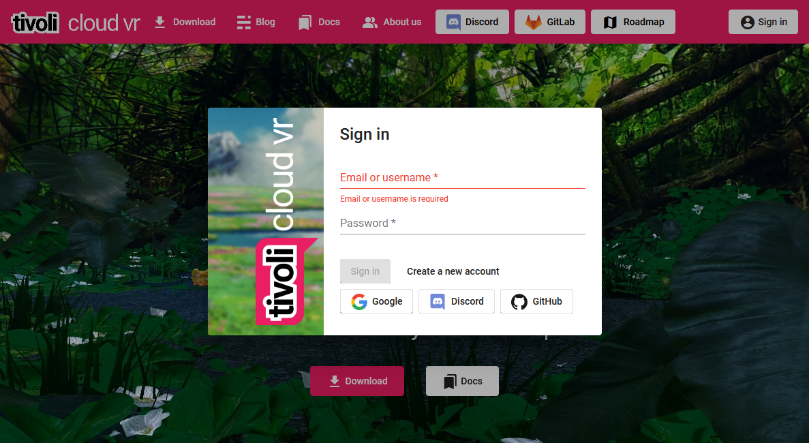
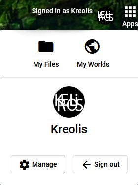
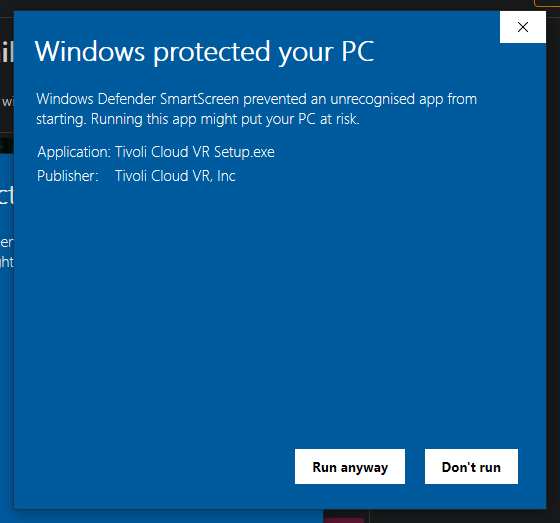
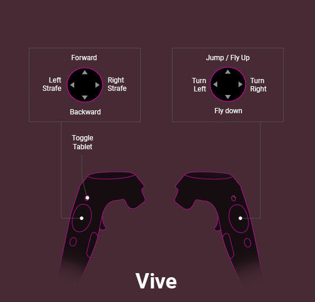
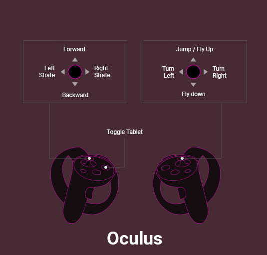

# Get started
!!! info "Early access"
    TivoliCloud VR is currently in early access. 
    We are constantly adding new features, which can introduce bugs and alter the experience.
    The early access version of Tivoli is unfinished and doesn't represent the final product.
    Issues can be reported <a href="https://roadmap.tivolicloud.com" target="_blank">here</a>.

## Create an Account
Create a Tivoli Cloud VR account on our <a href="https://alpha.tivolicloud.com" target="_blank">website</a>.
We will need a username and password from you. The username is public to all other users in world.

After you are sign in on our <a href="https://alpha.tivolicloud.com" target="_blank">website</a>, 
you can also find your account profile and the apps menu.

Use Manage to edit your profile. Your profile image will show up in your name tag in world.
With [My Files](/worlds/my-files) and [My Worlds](/worlds/world-settings) you can easily host files 
and control your domains.

## Download Client/Interface
Download our Tivoli Cloud VR launcher <a href="https://alpha.tivolicloud.com/download" target="_blank">here</a> and install it.
We have clients available for 64bit systems and the following operating systems: 

- Windows 10
- MacOS High Sierra (10.13) or higher
- all major Linux distributions via AppImage

Minimum system requirements:

- CPU: Intel i5 equivalent or greater
- RAM: 8GB+
- GPU: NVIDIA GTX 970 equivalent or greater
- Internet Connection:  20 Mbps download / 5 Mbps upload
- for VR: tethered HMD and controllers

!!! info "OS defense systems"
    Since Tivoli Cloud VR is in early access, your OS’ defense systems will flag the installer as unrecognised app: 

    On Windows: The Windows Defender Smart Screen will pop up. First click on “More info”, then on “Run anyway” to continue installation.

    

    On MacOS: Locate “Tivoli Cloud VR.dmg” in your downloads or applications folder and right-click on it, then select “Open”.
    It will not be installed otherwise. 

After installation has finished start the interface and login with your account.

## Launcher

## Controls
Use these control options to move around inworld 

!!! info 
    When you join a world a loading bar at the bottom will show up. 
    After it has finished loading (depending on your internet connection) you can move.

## Tablet
In VR our user interface is on a tablet which can pulled up by pressing in-app menu button on the left controller.
You will find the following apps there.

- [Avatar]()
- [Settings]()
- [Explore]()
- [Market]()
- [Create]()
- [Audio]()
- [Snapshot]()
- [Peoples]()

Most important for now is [Explore](). Here you will find all available domains with there worlds. Just click on one to explore it.

## Further information
If you want to host your own world, you will need your own server. Instructions can be found [here](worlds/host-a-world-advanced).
For questions or suggestions we are available on our <a href="https://discord.com/invite/FhuzTwR" target="_blank">discord</a> or via [email](mailto:support@tivolicloud.com).
