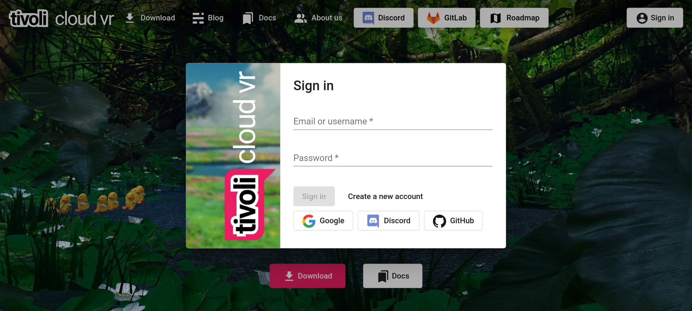
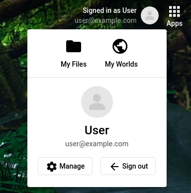
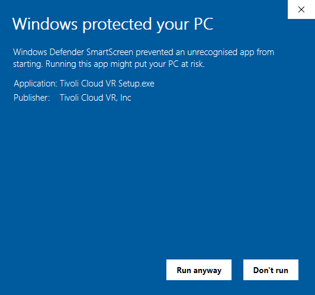
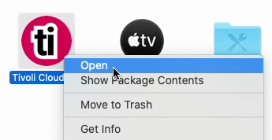
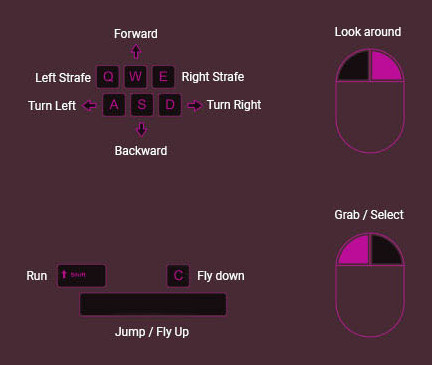
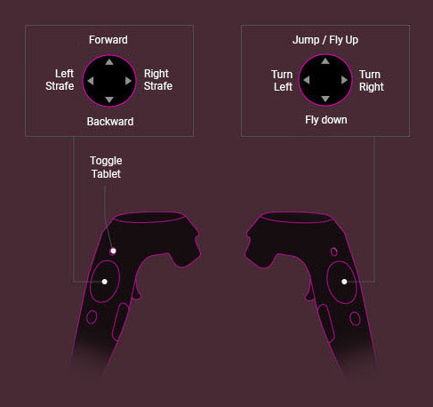
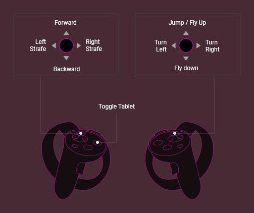
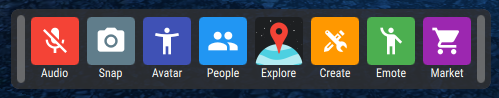
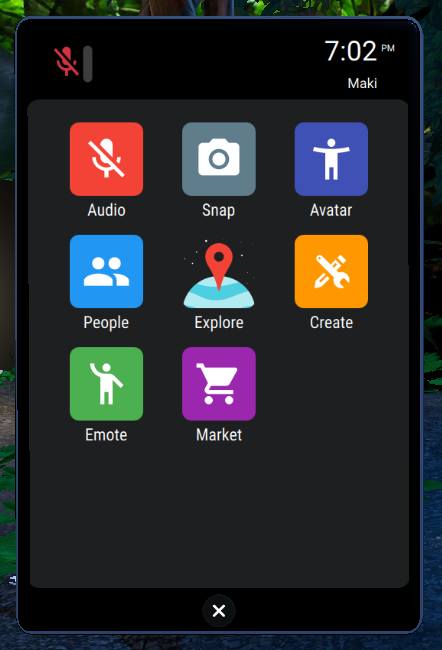

# Get started with Tivoli

!!! warning "Early access"

    Tivoli Cloud VR is currently in early access.
    We are constantly adding new features, which can introduce bugs and alter the experience.
    The early access version of Tivoli is unfinished and doesn't represent the final product.
    Issues can be reported <a href="https://roadmap.tivolicloud.com" target="_blank">here</a>.

## Create an account

You can <a href="https://alpha.tivolicloud.com" target="_blank">create a Tivoli Cloud VR account</a> on our website.

Sign up using **email and password**, or through one of the **external services**.

You will be asked for a **username**. It will be **permanent and public to all other users** in-world.

Once you've signed in, you can also find your **profile settings** and **available apps**.

-   Click  to change your **profile picture**, **email** and **password**.

    Your **profile picture will be public to all other users** as well.

    People will see **a tag above your avatar** in-world with your selected picture and username.

-    are also available

    -   <a href="https://alpha.tivolicloud.com/user/files" target="_blank">My Files</a> is your own personal file storage. You'll have **1 GB for free** which you can use to **upload avatars and 3D models**.

    -   <a href="https://alpha.tivolicloud.com/user/files" target="_blank">My Worlds</a> is where you can **manage your worlds**.

        !!! info "During early access, getting a server for a world is complicated"

            Eventually it will easy. However, there's an advanced guide for
             
            self-hosting on Linux which you can find [here](worlds/host-a-world-advanced)

## Downloading Tivoli and launching

<a href="https://alpha.tivolicloud.com/download" target="_blank">Download our Tivoli Cloud VR launcher</a> which you can install.

It's available for the following operating systems:

-   Windows 10
-   macOS High Sierra (10.13) or higher
-   All major Linux distributions

Minimum system requirements:

-   **CPU:** Intel i5 equivalent or greater
-   **RAM:** 8GB+
-   **GPU:** NVIDIA GTX 970 equivalent or greater
-   **Internet Connection:** 20 Mbps download / 5 Mbps upload
-   **For VR**: Any headset compatible with SteamVR or Oculus on PC

### If Tivoli isn't launching...

**Using Windows**, "Smart Screen" may appear.

-   First click on **More info**
-   Then click on **Run anyway** to continue

**Using macOS**, the launcher won't start after installing.

-   Locate **Tivoli Cloud VR** in your **Applications**
-   Right-click and click **Open**

You will only have to do this once.

## In-world controls

Use these controls to move your avatar around

### Keyboard

### HTC Vive

### Oculus

Newer Oculus controllers will work as well as above

## Toolbar and tablet

In-world, you can find **Tivoli apps**.

This is the **toolbar** when using **desktop** mode:

This is the **tablet** when using **VR** mode:

-   Use the **Explore** app to find worlds and meet people.

-   Use the **Market** app to pick out an avatar.

!!! info

    When you're joining a world, **a loading indicator will appear down below**.

    Depending on your internet connection, **it may take a while** until you can start moving.

## Further information

If you need help or have questions, we're available on our <a href="https://alpha.tivolicloud.com/discord" target="_blank">Discord</a>

If you have a suggestion or you found a bug, you can post it on our <a href="https://roadmap.tivolicloud.com" target="_blank">Roadmap</a>

More formally, you can contact us via email at [support@tivolicloud.com](mailto:support@tivolicloud.com).

## Recommended pages

-   [Changelog](index/changelog)
-   Worlds &ndash; [Host a world (advanced)](index/worlds/host-a-world-advanced)
-   Avatars &ndash; [Avatar standards](index/avatars/avatar-standards)
-   Scripts &ndash; [Get started with scripting](index/scripts/get-started)
-   Shaders &ndash; [Shader API reference](index/shaders/shader-api-reference)
