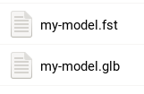
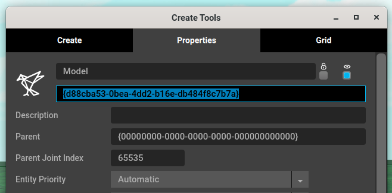
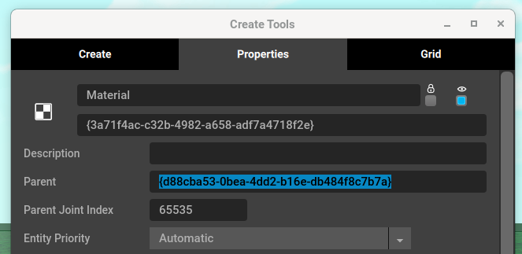
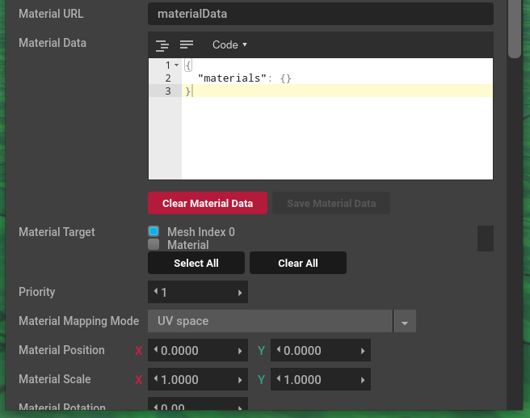

# Custom materials

With Tivoli, you can manually specify the properties of your materials. There are two different ways to do this.

-   **Write an .fst file** where the model and materials are specified **(recommended)**
-   **Parent a material entity** to a model in world **(not recommended)**
    -   Each materials will require another material entity.
    -   It's really inconvenient unless you're scripting.

## Writing an .fst file

Locate your 3D model and write a new `.fst` file next to it.



Open the `.fst` file in a text editor and with your model's filename:

```ini
filename = my-model.glb
materialMap = {"all":{"materials":{"unlit":true,"defaultFallthrough":true}}}
```

The `materialMap` specifies which materials to override. In this case it will keep the materials unchanged with `defaultFallthrough` but add `unlit` to `all` of them.

Open Tivoli and add a new model with the URL pointing to `my-model.fst` and you should see your model unlit!

## Materials specification

Here's an example of a `materialMap` json that applies different materials.

```json
{
	"all": {
		"material": {
			"defaultFallthrough": true,
			"unlit": true
		}
	},
	"mat::Head": {
		"materials": {
			"emissive": [1, 0, 0]
		}
	},
	"mat::Body": {
		"materials": {
			"defaultFallthrough": true,
			"opacity": 0.5
		}
	}
}
```

-   **All** materials will **stay the same** but now be **unlit**
-   The **`Head`** material will **be replaced** with **just red emissive**
-   The **`Body`** material will **stay the same** but now be **50% visible**

Hopefully that explains how to map materials with new properties. Here's the specification of every single property available:

[https://apidocs.tivolicloud.com/Graphics.html#.Material](https://apidocs.tivolicloud.com/Graphics.html#.Material)

You will need to **minify** the json when adding it to `materialMap`. This website will let you **minify** and **beautify** json:

[https://beautifyjson.org](https://beautifyjson.org) and
[https://minifyjson.org](https://minifyjson.org)

## Parenting a material entity

This isn't as recommended as [writing an .fst file](#writing-an-fst-file) but here's how it works.

Open Tivoli and in-world:

-   Add a new **model entity** with your 3D model
-   Add a new **material entity** with url **`materialData`**

You'll want to copy the **model entity's ID**:



Then paste it as the **parent** in the **material entity**:



Your model should now have all the default material settings without any textures or colors.

In the **material entity** scroll down till you find material properties:



This is where you can set your **material data** and which material it should target.
