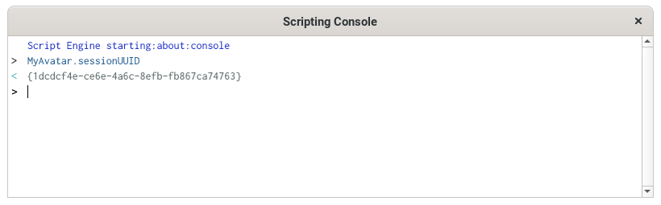
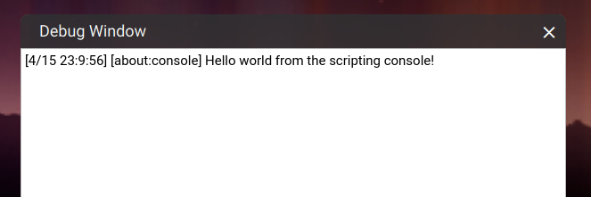

# Get started with scripting

Tivoli uses **JavaScript** for creating all kinds of experiences. You can create content, play audio, moving people around and make user apps. With our API you're capable of creating almost anything you can think of.

The standard client uses lots of default scripts to create the end user experience. But you're capable of running your own scripts on the client, entities and server.

## JavaScript Basics

Tivoli uses QtScriptEngine to provide a scripting environment.

!!! warning

    Unfortunately our JS engine is deprecated and is due for a redesign.

    Currently our scripts require **ES3 standard JavaScript** in order to run.

    [However **experimental TypeScript** support](https://roadmap.tivolicloud.com/posts/18/modern-integrated-typescript-support-for-scripts) is coming soon which will let you use modern JavaScript/TypeScript.

When interfacing with the API, you're likely to use these namespaces:

<table>
    <tr>
        <th>Namespace</th>
        <th>Description</th>
    </tr>
    <tr>
        <td>
            <a href="https://apidocs.tivolicloud.com/Entities.html" target="_blank">Entities</a>
        </td>
        <td>
            Lets you manipulate entities around you if you have the required permission. This means you can add, remove and edit entities. Everyone has access to the properties of an entity which can be used to find entities in range, direction, collision or rays.
            

                
Warning

                

                    Beware that everyone can use
                     
                    <code>Entities.getEntityProperties(entityID).modelURL</code>
                     
                    to gain access to the URLs of models.
                

            

        </td>
    </tr>
    <tr>
        <td>
            <a href="https://apidocs.tivolicloud.com/AvatarList.html" target="_blank">AvatarList</a>
            <a href="https://apidocs.tivolicloud.com/AvatarManager.html" target="_blank">AvatarManager</a>
            <a href="https://apidocs.tivolicloud.com/MyAvatar.html" target="_blank">MyAvatar</a>
        </td>
        <td>
            Lets you get information on an <a href="https://apidocs.tivolicloud.com/Avatar.html" target="_blank">Avatar</a> or manipulate your own client-only <a href="https://apidocs.tivolicloud.com/MyAvatar.html" target="_blank">MyAvatar</a>. The information will always be of the client running the script. AvatarList and AvatarManager are basically the same but for different contexts.
        </td>
    </tr>
    <tr>
        <td>
            <a href="https://apidocs.tivolicloud.com/Script.html" target="_blank">Script</a>
        </td>
        <td>
            Lets you connect callbacks from your client to the script, such as functionality that depend on time <code>Script.update, Script.setTimeout, Script.setInterval</code>
              
            Connect paths relatively from the script location <code>Script.relativePath</code>
              
            Include other scripts <code>Script.include</code> (which unfortunately doesn't work for classes)
              
            Or cleanup when the script is turned off <code>Script.scriptEnding</code>
        </td>
    </tr>
</table>

There are [many other namespaces available](https://apidocs.tivolicloud.com) in our API. Feel free to explore them!

## Types of scripts

| Script type              | Description                                                                                                                                                                 |
| ------------------------ | --------------------------------------------------------------------------------------------------------------------------------------------------------------------------- |
| Interface script         | Interface scripts run on the interface client. You can perform single tasks or create apps, menus, overlays, tweaks or extensions.                                          |
| Assignment client script | Assignment client scripts run on the world server. They can interact with entities or avatars and continue running as long as the world is running.                         |
| Avatar script            | Avatar script run on the avatar and can give it unique effects.                                                                                                             |
| Client entity script     | Client entity scripts are scripts attached to entities that run locally. You can control what happens when a user interacts with an entity.                                 |
| Server entity script     | Server entity scripts are scripts attached to entities that run on the server. These scripts control entities and their behavior is seen and heard by everyone in the world |

## Script permissions

Each server owner has the ability to set create/edit permissions. If the script you want to run adds or edits entities and you don't have the permission to do so, you wont see anything created or changed. However the script will still continue running.

## Running scripts window

The running scripts window can be used to load, run and stop scripts from a URL or from disk.

To open the running scripts window, go to **Edit > Running Scripts** or press <kbd>CTRL</kbd> + <kbd>J</kbd> on your keyboard.

## Scripting console

The scripting console lets you test and run short script snippets quickly to see how they work.

To open the console go to **Developer > Scripting > Console**. If the **Developer** menu is not visible, enable **Settings > Developer Menu**. You can also press <kbd>CTRL</kbd> + <kbd>ALT</kbd> + <kbd>J</kbd>.

## Script log (Debug window)

The script log shows the output of your running scripts. This is used for debugging and when something is not working as intended. It can point you to the line of code where an error happened.

To open the script log, go to **Developer > Scripting > Script Log (HMD Friendly)**. If the **Developer** menu is not visible, enable **Settings > Developer Menu**.

