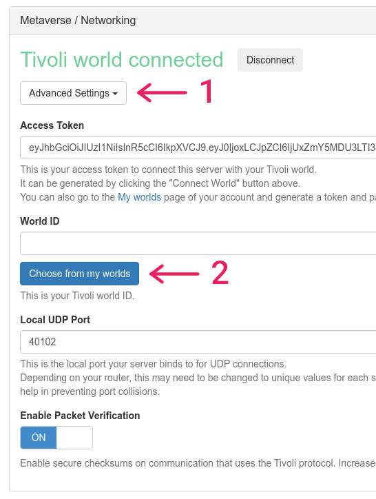
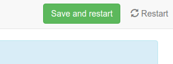
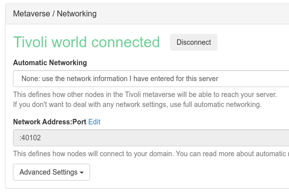

This guide is currently the only way to host a Tivoli world.

You will need:

-   a little bit of knowledge of how **Docker** works
-   a machine with any distribution of **Linux 64 bit, x86_64 or arm64v8**

## 1. Install Docker and Docker Compose

If you're using **Ubuntu** (from the official docs [Docker](https://docs.docker.com/install/linux/docker-ce/ubuntu/) and [Docker Compose](https://docs.docker.com/compose/install/)):

```bash
sudo apt-get update -y
sudo apt-get install -y curl python3-pip
# docker
curl -fsSL https://get.docker.com -o get-docker.sh
sudo sh get-docker.sh
# docker compose
sudo pip3 install docker-compose
# start system service
sudo systemctl enable docker
sudo systemctl start docker
# add user to group
sudo usermod -aG docker $USER
```

Or if you're using **Arch Linux**:

```bash
sudo pacman -Sy docker docker-compose
sudo systemctl enable docker
sudo systemctl start docker
sudo usermod -aG docker $USER
```

You will have to log out so that your current user is part of the `docker` group.

Run `docker system info` to verify if it's running and installed.

If you're using another distro, look here:

-   Docker: [https://docs.docker.com/install](https://docs.docker.com/install)
-   Docker Compose: [https://docs.docker.com/compose/install](https://docs.docker.com/compose/install)

You will find plenty of guides on Google too.

## 2. Structuring your configuration

You will need to **create a folder** where all your world(s) will live. This is **entirely portable** so it's **easy to backup** or migrate.

```bash
mkdir worlds
cd worlds
```

Write a new file **inside the folder** using your favorite text editor:

**`docker-compose.yml`**

```yml
version: "3.6"
services:
    my-world:
        image: registry.tivolicloud.com/tivolicloud/interface/server:latest
        network_mode: host
        restart: always
        logging:
            driver: none
        volumes:
            - ./my-world:/root/.local/share/Tivoli Cloud VR
        environment:
            - HIFI_DOMAIN_SERVER_HTTP_PORT=40100
            - HIFI_DOMAIN_SERVER_HTTPS_PORT=40101
            - HIFI_DOMAIN_SERVER_PORT=40102
            - HIFI_DOMAIN_SERVER_DTLS_PORT=40103

            - HIFI_ASSIGNMENT_CLIENT_AUDIO_MIXER_PORT=48000
            - HIFI_ASSIGNMENT_CLIENT_AVATAR_MIXER_PORT=48001
            - HIFI_ASSIGNMENT_CLIENT_ASSET_SERVER_PORT=48003
            - HIFI_ASSIGNMENT_CLIENT_MESSAGES_MIXER_PORT=48004
            - HIFI_ASSIGNMENT_CLIENT_ENTITY_SCRIPT_SERVER_PORT=48005
            - HIFI_ASSIGNMENT_CLIENT_ENTITIES_SERVER_PORT=48006
```

Rename every instance of `my-world` with the name of your world.

```yml
volumes:
    - ./my-world:/root/.local/share/Tivoli Cloud VR
```

This part of the config explains that Docker should **mount the folder `my-world`** inside of your working folder **to the server configuration files**.

Please make sure there's **only one volume mounted per server**. This folder must be kept safe.

Feel free to **duplicate the service for as many worlds as you want**. However, remember that the server software can be heavy to run if there are many people connected.

If you add more than one server, **you must update the port numbers** defined in the environment array. Usually we go up in increments of 10 but you can set them to whatever you like.

## 3. Starting, restarting, stopping and updating

Docker Compose is really awesome for running Docker containers. This is all super easy.

Make sure you're inside the folder where `docker-compose.yml` is and you can run:

-   `docker-compose up -d` **starts all servers** and **syncs your `docker-compose.yml` config**.
-   `docker-compose down` **stops all servers**, gracefully.
-   `docker-compose pull` **checks if there's a new version** and **downloads it**.
    -   Run `up -d` after and **all your servers will update** to the new version.
-   `docker-compose restart/stop/start my-world` will **restart, stop or start a server**.
-   `docker-compose logs -f` **shows the logs** for all servers.

There are some Docker commands you might want to know as well:

-   `docker images` **shows all downloaded images** on your machine. **These can be big!**
-   `docker rmi` **removes an image** such as an old version of Tivoli server.
-   `docker ps` **shows all running docker containers**.

Check the servers' logs and if there are no errors, it's running!

If you want to update your servers, run these commands:

```bash
docker-compose pull
docker-compose up -d
```

## 4. Connecting your server to a Tivoli world

This part is a **little messy and that will change**. We're still in alpha and have major redesigning to do from the old server admin panel.

-   Open your web browser and visit: [http://localhost:40100](http://localhost:40100)
-   **Step 1 of 2**:

    -   Click **"Connect your Tivoli Cloud World"** and you will be redirected to your worlds.
    -   Click **"Create new world"** and fill as much as you can.
    -   Once your world has been created, click **"Generate new access token"** and copy the token.
        -   This is a **secret key that binds your server to your world**. You can revoke it at any time by generating a new token.
    -   Go back to your **server web page and paste the token**. Click **"OK"**.

-   **Step 2 of 2**:

    -   Add the **usernames of the people who you want to give full permissions** to.
    -   Who can join and create:
        -   **None**: Nobody will have access. Will make your world private.
        -   **Friends**: Your friends from the account you connected the server with.
        -   **Everyone logged in**: Securely available to everyone.

-   **Linking the server correctly with the world**:

    -   You will now find yourself in the admin panel. In the **settings** page at the very top:<br />
    -   Expand **"Advanced Settings"** and click **"Choose from my worlds"**. Only one world will be available.
    -   Click **"Save and restart"**:<br />
    -   After the page has reloaded, you will now find:<br />

    -   **Automatic Networking** must be set to either:

        -   **Full**: This **doesn't require port forwarding**. It will automatically establish a connection using the ICE protocol.

            !!! warning

                Whilst this is really convenient, keep in mind that **this can cause connection problems**. It's **much more reliable to port forward** and use the below instead.

        -   **IP Only**: Just specify the port and it will work as a free DNS.
        -   **None**: Where you specify a static external IP address and port.

            -   **Network Address:Port** or **Network Port** must be set accordingly. The port is set to `HIFI_DOMAIN_SERVER_PORT` which is usually `40102` (+2 from the admin panel HTTP port)

            !!! info

                If **Automatic Networking is not set to full**, you'll have to make sure that these ports are open on your firewall or router for **TCP and UDP**:

                -   `40100-40110`
                -   `48000-48010`

Now that those settings have been set, everything should work!

## 5. Installation complete!

You can now find your world in [https://tivolicloud.com/user/worlds](https://tivolicloud.com/user/worlds) which should indicate that there are **0 users**. If it says **Offline**, then something went wrong.

You can always **message us or the community for help** on our **Discord server**. [https://tivolicloud.com/discord](https://tivolicloud.com/discord)

I hope this guide was useful to you and you can enjoy your own space in the metaverse!

Thank you for reading,

Maki
