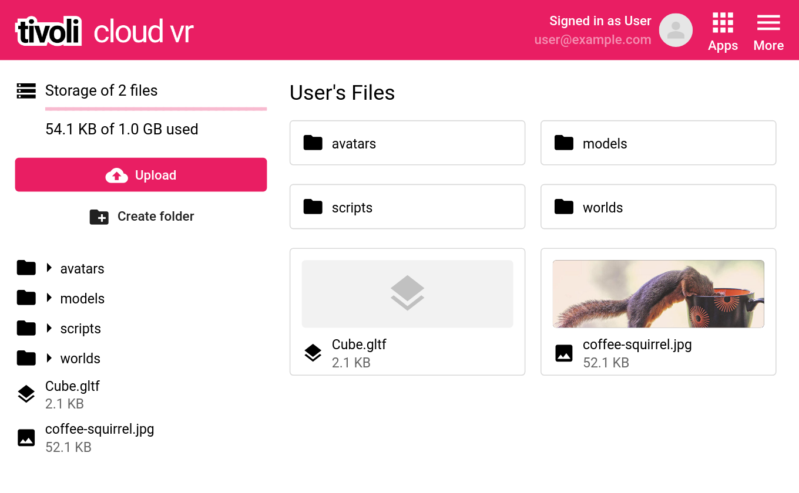

# My Files
For better performance, we recommend to host all your in world files on our server. See our interface <a href="https://alpha.tivolicloud.com/user/files" target="_blank">here</a>.

Just upload your scripts and models here. You can then easliy link them in world.

You can create folders for your organisation as you like. By right clicking you will find further options per file or folder like delete and rename.
