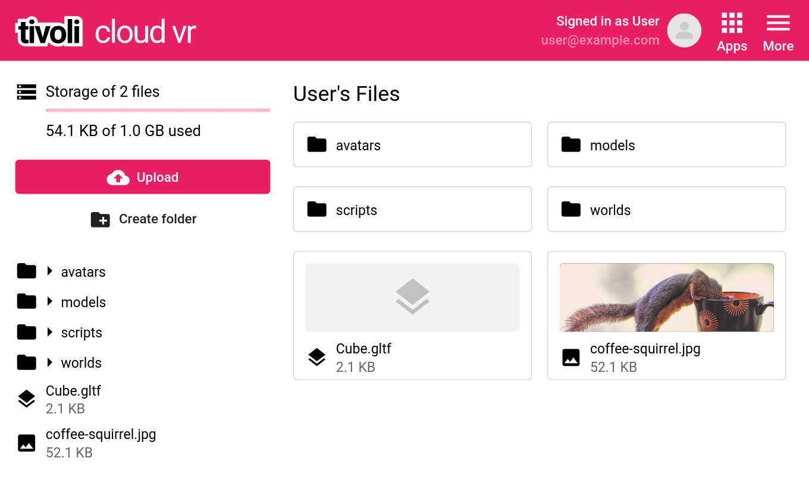
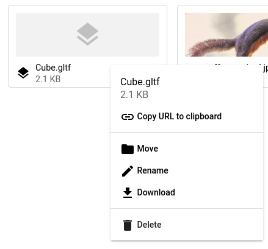

# Uploading assets with Tivoli

!!! info

    Tivoli files is still **work in progress**, however its **very stable**. You may have problems with the user interface. If you want to suggest changes or report bugs, please post them on our <a href="https://roadmap.tivolicloud.com" target="_blank">Roadmap</a>.

Tivoli provides **free file storage of 1GB for free**, soon to be expandable.

Anything you upload will be hosted on **an infinitely scalable ultra fast server**. It's recommended that you use it so that users can **load worlds as fast as possible** without causing more lag.

You can find <a href="https://tivolicloud.com/user/files" target="_blank">**My Files**</a> on the Tivoli website under **Apps**.

Create **folders to organize your content**

Upload assets such as: **3D models, images, scripts, audio** and more.

Right mouse click on a file or folder to bring up it's context menu.

**Copy URL to clipboard** will give you the link to your file. Use this in-world so that others can see your content.

If your username is **User**, the link to the model below would be **`https://files.tivolicloud.com/user/Cube.gltf`**

You can **create as many folders as you want**. An example URL would be **`https://files.tivolicloud.com/user/worlds/my-garden/pretty-flowers/cosmos.gltf`**

